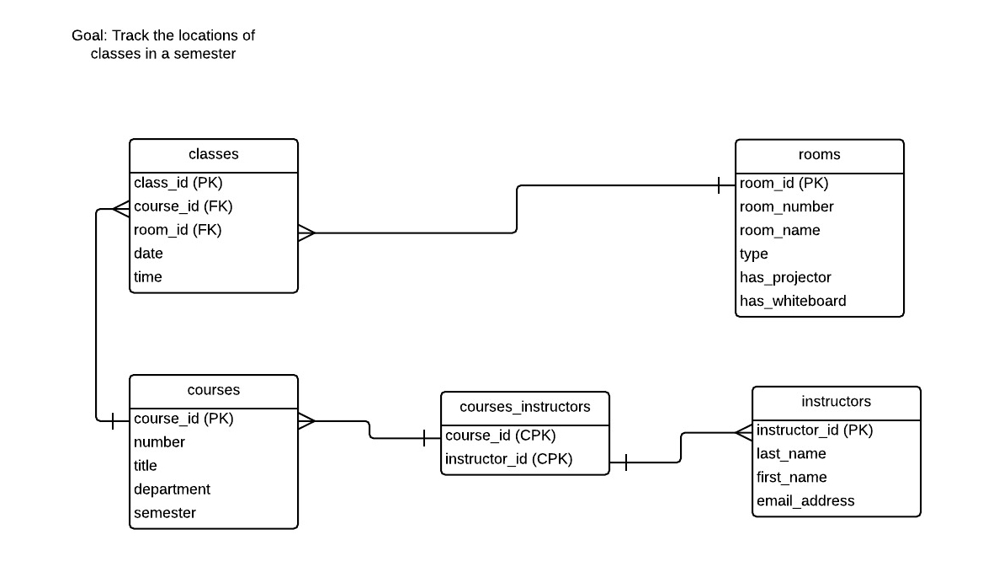

# Introduction to Relational Databases

## Overview of the workshop

In this 4-hour workshop, participants will learn the basics of data modeling for relational databases, the relational database development process, and querying relational databases using SQL (Structured Query Language). The workshop will also present an overview of how relational databases are integrated into websites and other types of applications. The workshop will include a number of hands-on exercises and the chance to create, populate, and query a simple database.

## How relational databases work

### Tables, relationships, and IDs

Relational databases strucutre data in tables, and provide mechanisms for linking (relating) those tables together to so that the data can be queried and managed efficiently. For example, if we wanted to manage a list of books, we would create a table that contained some data about those books:


Each row in the table describes a single book, and the data is organized into columns, with each intersection of a row and a column containing a single piece of data. But if each intersection of a row and a column can contain only one piece of data, how do we handle data that can apply more than once to each book, such as its author? It's pretty common for a book to have more than one author.

Relational databases organize data into multiple tables, and link the tables together so that all the data about something (in our example, a single book) can be assembled from the relevant tables as needed. In order to make sure the links between tables are trustworthy, each row in each table needs to have a unique identifier. We will provide more information about identifiers (commonly called "ids") shortly but notice that all of the tables depicted below have ID columns.

If we put data about authors in its own table, we can allow each book to have multiple authors. Because each book can have many authors, and each author can have written more than one book, we say that books and authors have a "many-to-many" relationship with each other. Relational databases accommodate this type of relationship by using a third table whose function is to relate the two things described in separate tables, as illustrated in this diagram:


This intermediate table (in this example, BooksAuthors) is known as a "relation" or "join" table. For this method of breaking up data into multiple tables to work reliably, we need to ensure that each row in the books table and each row in the authors table can be referenced uniquely. To do this, we need to assign identifiers to each rown in the book and authors tables, and we use those identifiers to relate the two tables to each other in the third table. In our example, we will call these ID columns 'book_id' and 'author_id'. We will see some examples of these identifiers in the query examples below.

"One-to-many" relationships don't use a third table. This type of relationship links two tables, one containing the data that is on the "one" side of the relationship and the other that is on the "many" side. For example, each book can have many editions, but each edition applies to only a single book:


One-to-many relationships also require that rows in tables have unique IDs, but unlike in the join table used in many-to-many relationship, the table that contains the data describing the "many" side of the relationship has a column reserved for the ID of the "one" side of the relationship. 

The IDs used to uniquely identify the things described in tables are called "primary keys". If the primary key of one table is used in another table, the key in the other table is called a "foreign key" in that table. For example, the "book_id" column in the Books table is that table's primary key, but the "book_id" column in the Editions table is a foreign key. The purpose of foreign keys is to link the two tables.

You may be wondering why we didn't use ISBN for the unique ID for each row in the Books table. We could have done that, but there is a problem with ISBNs: it is easy for a human operator to make an error while entering them. Since primary keys need to be unique, we don't want to use something as the primary key that we can't trust to be unique. If we used ISBNs as primary keys, and we encountered one that was the same as an ISBN that was already in our database, the database would not save the row. If your rows have attributes that you can be absolutley sure will be unique, you can use that attribute as a primary key, but it's usually safer, and a common convention, to let the RDBMS assign an auto-incremented integer as the primary key.

For join tables, the primary key for each row is the unique _combination_ of the foreign keys from the two joined tables. In our example, the primary key of BooksAuthors is the combination of book_id and author_id. A primary key that is comprised of more than one attribute is called a "composite key."

Putting together all of our tables, we get a database structure that can be represented like this:


Books, Authors, and Editions all have a unique ID (book_id, author_id, and edition_id respectively) that is used as their primary key (labelled as PK in the diagram above), and Editions contains the foreign key (FK) book_id that links it to the Books table in a one-to-many relationship. The join table BooksAuthors only has two columns, book_id and author_id, which are both foreign keys that make up a composite primary key (CPK).

(It should be noted that this database portrays the relationships between books, authors, and editions in rather simplistic terms. For example, different manifestations of a book such as a paperback and an ebook usually have different ISBNs, and two different editions of a book can have different authors. Despite these issues, the database will suffice as an example of a simple relational model.)

Here are the tables, structured as illustrated above, with some data in them. Note that the order of the columns is not the same as in the diagrams:

Books

```
+---------+------------------------------------------------------+---------------+
| book_id | title                                                | ISBN          |
+---------+------------------------------------------------------+---------------+
|       1 | Creating relational databases for fun and profit     | 7654321123456 |
|       2 | Relational databases for really, really smart people | 9876543212345 |
|       3 | My life with relational databases: a memoir          | 3212345678909 |
|       4 | Relational databases: an existential journey         | 8172635412345 |
+---------+------------------------------------------------------+---------------+
```

Authors
```
+-----------+---------------+------------+
| author_id | last_name     | first_name |
+-----------+---------------+------------+
|         1 | Lopez Baranda | Christina  |
|         2 | Jin-Soon      | Sin        |
|         3 | Jones         | Hannah     |
|         4 | Novak         | Stanislaw  |
|         5 | Turay         | Tandice    |
|         6 | Roy           | Shanta     |
|         7 | Berger        | Henry      |
|         8 | Khatami       | Paree      |
+-----------+---------------+------------+
```

BooksAuthors
```
+---------+-----------+
| book_id | author_id |
+---------+-----------+
|       3 |         6 |
|       2 |         4 |
|       2 |         5 |
|       1 |         1 |
|       1 |         3 |
|       1 |         5 |
|       4 |         8 |
+---------+-----------+
```

Editions
```
+------------+---------+---------------------+----------------+
| edition_id | book_id | date_of_publication | edition_number |
+------------+---------+---------------------+----------------+
|          1 |       3 |                2001 | 1              |
|          2 |       3 |                2003 | 2              |
|          3 |       4 |                2003 | 1              |
|          5 |       1 |                2000 | 1              |
|          6 |       3 |                2005 | 3              |
|          8 |       2 |                2012 | 1              |
|          9 |       3 |                2009 | 4              |
+------------+---------+---------------------+----------------+
```

### Data types and indexing

Now that we have a structure for our database, and have seen some sample data, we can move on to querying the database. But first, it will be useful to learn about data types.

As you can see from the sample data, some of the columns contain what look like simple numbers and some columns contain text. The Authors table illustrates this well: the author_id column contains incrementing digits while the last_name and first_name columns contain... names. RDBMSs require that when you create a table, you specify a "data type" for each column. There are a number of common data types, but the most common are:

* integer (a negarive or positive number that does not have a fractional component)
* varchar (which is short for "variable character data," or in other words, text)
* text (text)
* boolean (either true or false; represented in some systems as 1 or 0, respectively)

Columns that are of varchar or text data types both contain text. The distinction between the two is mostly a matter of implementation and with the RDBMS. In this workshop we will use the text data type when creating tables. Even though we do not cover the distinctions between varchar and text, or introduce other data types, determining which data type a column should have is very important step in designing higly performant and optimized databases. Choosing the wrong data type for a column can have a dramatic impact on a database's speed and the amount of disk space it consumes, especially when the database has tables containing thousands or millions of rows.

One of the most common uses of the integer data type is to define "auto-increment" columns in a table. An important rule that you need to follow when choosing a data type for a column is that if you want the RDBMS to generate unique IDs for rows in a table, define the ID column in the table to be an auto-incrementing integer. If you do that, every new row added to the table will get a value in the ID column that is 1 higher than the value in that column for most recently created row. If you look at the Books, Authors, and Editions tables above, you will see the ascending values in the ID columns. The order of the IDs reflects the order in which the rows were added to the tables.

A corollary to this rule is that the data type for columns that are foreign keys should be the same as the data type for the primary key they link to. Therefore, if primary keys are of type integer, then foreign keys should be as well.

Columns of type boolean have two possible values, true or false. Most RDBMSs represent true and false as the integers 1 and 0, respectively.

Defining indexes on columns is also a very important component in designing highly scalable databases, but we won't cover it in this workshop. Indexes allow the RDBMS to very quickly locate a particular row in a table without having to search every row. It is very common to define an index on a column if the table that the column is in is queried often. Primary and foreign keys are commonly indexed for this reason.

### Querying tables using SQL

After we have populated the database with data (we'll explain how to do that later), we can query it using SQL (the Structured Query Language). For example, to view all information stored in the Authors table, sorted by last name, we use the following query:

```sql
SELECT * FROM Authors ORDER by last_name;
```

which produces the following:

```
+-----------+---------------+------------+
| author_id | last_name     | first_name |
+-----------+---------------+------------+
|         7 | Berger        | Henry      |
|         2 | Jin-Soon      | Sin        |
|         3 | Jones         | Hannah     |
|         8 | Khatami       | Paree      |
|         1 | Lopez Baranda | Christina  |
|         4 | Novak         | Stanislaw  |
|         6 | Roy           | Shanta     |
|         5 | Turay         | Tandice    |
+-----------+---------------+------------+
8 rows in set (0.01 sec)

```

Using uppercase for SQL commands is a convention only, it's not mandatory. Also, the output we're seeing here is specific to the MySQL command-line client, which we're not using in this workshop but which we will see illustrated below. How you query the databaase, and how the results output will look will depend on what tool you are using to manage the database.

This query asks for the first and last names of authors of the book with book_id 1:

```sql
SELECT DISTINCT first_name, last_name
FROM Authors, BooksAuthors, Books
WHERE BooksAuthors.author_id = Authors.author_id
AND BooksAuthors.book_id = 1;
```
The results are:

```
+------------+---------------+
| first_name | last_name     |
+------------+---------------+
| Hannah     | Jones         |
| Christina  | Lopez Baranda |
| Tandice    | Turay         |
+------------+---------------+
3 rows in set (0.01 sec)
```

This query is more complex than the first one, because it is asking for data from multiple tables. It relates the tables using the clause `WHERE BooksAuthors.author_id = Authors.author_id`, which in relational database jargon is called a "join" query (not to be confused with the join table used to store many-to-many relationships.)

To find the book IDs, titles, and ISBNs that have editions published after (that is, greater than) 2003, we would use this SQL query:

```sql
SELECT Books.book_id, title, ISBN, date_of_publication
FROM Books, Editions
WHERE Books.book_id = Editions.book_id
AND Editions.date_of_publication > '2003';
```

which returns the folowing results:

```
+---------+------------------------------------------------------+---------------+---------------------+
| book_id | title                                                | ISBN          | date_of_publication |
+---------+------------------------------------------------------+---------------+---------------------+
|       2 | Relational databases for really, really smart people | 9876543212345 |                2012 |
|       3 | My life with relational databases: a memoir          | 3212345678909 |                2005 |
|       3 | My life with relational databases: a memoir          | 3212345678909 |                2009 |
+---------+------------------------------------------------------+---------------+---------------------+
3 rows in set (0.00 sec)
```
You'll notice repetition in the book_id, title, and ISBN columns in the results. Those columns are the ones we're asking for in the query, so the response is correct, since we're also asking for the date of publication from the Editions table, which in our results contains the correct values.

You'll also notice that in this last query, we referred to Books.book_id and Editions.book_id. Since the column book_id exists in more than one table, we need to disambiguate which book_id column we mean. RDBMSs let us refer columns in specific tables this way (in fact, they require it in situations where the column name is ambiguous).

### Relational database management systems

#### Common systems

There are many proprietary and open source relational database management systems (RDBMSs). The most common include:

* [MySQL](https://www.mysql.com/)
* [PostgreSQL](http://www.postgresql.org/)
* [MariaDB](https://mariadb.org/)
* [SQLite](http://www.sqlite.org/)
* [Microsoft Access](https://products.office.com/en-us/access)
* [Filemaker](http://www.filemaker.com/products/overview.html)
* [Microsoft SQL Server](http://www.microsoft.com/en-ca/server-cloud/products/sql-server/)
* [Oracle](https://www.oracle.com/database/index.html)

While SQL is an [international standard](http://en.wikipedia.org/wiki/SQL#Standardization), and most of the systems listed above implement it thoroughly, every RDBMS has features or extensions to SQL that differentiate it from its competitors. Some, like Microsoft Access and Filemaker, include full graphical user interfaces to creating and querying databases. Others, like MySQL and PostgreSQL, include only a back-end server and command-line clients for querying and administration. It is common for third-party tools to be used to interact with these databases. Some of these tools are described in the next section.


#### Interacting with RDBMSs

In this workshop, we'll be interacting with our databases using a web-based management tool called [Adminer](http://www.adminer.org/). However, it is important to note that there are a variety of ways to interact with relational databases.

##### Command-line clients

MySQL, PostgreSQL, and SQLite come with a command-line client. To invoke MySQL's client as the database's root user on Linux, you run the command `mysql -uroot -p`. After providing the root user's password, you enter the MySQL shell, which looks like this:


You then issue SQL and MySQL-specific commands within the MySQL shell, like this:


Other command-line clients exist for specific purposes. For example, a database developer or administrator would use the `mysqldump` command to produce a "dump" of a MySQL database for backup purposes or for moving to a different server. The dump contains all the SQL commands (and data, if there is any) required to recreate the database. For example, this is a dump of the Books database we saw earlier in the workshop:

```sql
-- MySQL dump 10.13  Distrib 5.5.41, for debian-linux-gnu (i686)
--
-- Host: localhost    Database: Books
-- ------------------------------------------------------
-- Server version	5.5.41-0ubuntu0.14.04.1-log

/*!40101 SET @OLD_CHARACTER_SET_CLIENT=@@CHARACTER_SET_CLIENT */;
/*!40101 SET @OLD_CHARACTER_SET_RESULTS=@@CHARACTER_SET_RESULTS */;
/*!40101 SET @OLD_COLLATION_CONNECTION=@@COLLATION_CONNECTION */;
/*!40101 SET NAMES utf8 */;
/*!40103 SET @OLD_TIME_ZONE=@@TIME_ZONE */;
/*!40103 SET TIME_ZONE='+00:00' */;
/*!40014 SET @OLD_UNIQUE_CHECKS=@@UNIQUE_CHECKS, UNIQUE_CHECKS=0 */;
/*!40014 SET @OLD_FOREIGN_KEY_CHECKS=@@FOREIGN_KEY_CHECKS, FOREIGN_KEY_CHECKS=0 */;
/*!40101 SET @OLD_SQL_MODE=@@SQL_MODE, SQL_MODE='NO_AUTO_VALUE_ON_ZERO' */;
/*!40111 SET @OLD_SQL_NOTES=@@SQL_NOTES, SQL_NOTES=0 */;

--
-- Table structure for table `Authors`
--

DROP TABLE IF EXISTS `Authors`;
/*!40101 SET @saved_cs_client     = @@character_set_client */;
/*!40101 SET character_set_client = utf8 */;
CREATE TABLE `Authors` (
  `author_id` int(11) NOT NULL AUTO_INCREMENT,
  `last_name` text COLLATE utf8_unicode_ci NOT NULL,
  `first_name` text COLLATE utf8_unicode_ci NOT NULL,
  PRIMARY KEY (`author_id`)
) ENGINE=InnoDB AUTO_INCREMENT=9 DEFAULT CHARSET=utf8 COLLATE=utf8_unicode_ci;
/*!40101 SET character_set_client = @saved_cs_client */;

--
-- Dumping data for table `Authors`
--

LOCK TABLES `Authors` WRITE;
/*!40000 ALTER TABLE `Authors` DISABLE KEYS */;
INSERT INTO `Authors` VALUES (1,'Lopez Baranda','Christina'),(2,'Jin-Soon','Sin'),(3,'Jones','Hannah'),(4,'Novak','Stanislaw'),(5,'Turay','Tandice'),(6,'Roy','Shanta'),(7,'Berger','Henry'),(8,'Khatami','Paree');
/*!40000 ALTER TABLE `Authors` ENABLE KEYS */;
UNLOCK TABLES;

--
-- Table structure for table `Books`
--

DROP TABLE IF EXISTS `Books`;
/*!40101 SET @saved_cs_client     = @@character_set_client */;
/*!40101 SET character_set_client = utf8 */;
CREATE TABLE `Books` (
  `book_id` int(11) NOT NULL AUTO_INCREMENT,
  `title` text COLLATE utf8_unicode_ci NOT NULL,
  `ISBN` text COLLATE utf8_unicode_ci NOT NULL,
  PRIMARY KEY (`book_id`)
) ENGINE=InnoDB AUTO_INCREMENT=5 DEFAULT CHARSET=utf8 COLLATE=utf8_unicode_ci;
/*!40101 SET character_set_client = @saved_cs_client */;

--
-- Dumping data for table `Books`
--

LOCK TABLES `Books` WRITE;
/*!40000 ALTER TABLE `Books` DISABLE KEYS */;
INSERT INTO `Books` VALUES (1,'Creating relational databases for fun and profit','7654321123456'),(2,'Relational databases for really, really smart people','9876543212345'),(3,'My life with relational databases: a memoir','3212345678909'),(4,'Relational databases: an existential journey','8172635412345');
/*!40000 ALTER TABLE `Books` ENABLE KEYS */;
UNLOCK TABLES;

--
-- Table structure for table `BooksAuthors`
--

DROP TABLE IF EXISTS `BooksAuthors`;
/*!40101 SET @saved_cs_client     = @@character_set_client */;
/*!40101 SET character_set_client = utf8 */;
CREATE TABLE `BooksAuthors` (
  `book_id` int(11) NOT NULL,
  `author_id` int(11) NOT NULL,
  KEY `book_id` (`book_id`),
  KEY `author_id` (`author_id`),
  CONSTRAINT `BooksAuthors_ibfk_2` FOREIGN KEY (`author_id`) REFERENCES `Authors` (`author_id`),
  CONSTRAINT `BooksAuthors_ibfk_1` FOREIGN KEY (`book_id`) REFERENCES `Books` (`book_id`)
) ENGINE=InnoDB DEFAULT CHARSET=utf8 COLLATE=utf8_unicode_ci;
/*!40101 SET character_set_client = @saved_cs_client */;

--
-- Dumping data for table `BooksAuthors`
--

LOCK TABLES `BooksAuthors` WRITE;
/*!40000 ALTER TABLE `BooksAuthors` DISABLE KEYS */;
INSERT INTO `BooksAuthors` VALUES (3,6),(2,4),(2,5),(1,1),(1,3),(1,5),(4,8);
/*!40000 ALTER TABLE `BooksAuthors` ENABLE KEYS */;
UNLOCK TABLES;

--
-- Table structure for table `Editions`
--

DROP TABLE IF EXISTS `Editions`;
/*!40101 SET @saved_cs_client     = @@character_set_client */;
/*!40101 SET character_set_client = utf8 */;
CREATE TABLE `Editions` (
  `edition_id` int(11) NOT NULL AUTO_INCREMENT,
  `book_id` int(11) NOT NULL,
  `date_of_publication` year(4) NOT NULL,
  `edition_number` text COLLATE utf8_unicode_ci NOT NULL,
  PRIMARY KEY (`edition_id`),
  KEY `book_id` (`book_id`),
  CONSTRAINT `Editions_ibfk_1` FOREIGN KEY (`book_id`) REFERENCES `Books` (`book_id`)
) ENGINE=InnoDB AUTO_INCREMENT=10 DEFAULT CHARSET=utf8 COLLATE=utf8_unicode_ci;
/*!40101 SET character_set_client = @saved_cs_client */;

--
-- Dumping data for table `Editions`
--

LOCK TABLES `Editions` WRITE;
/*!40000 ALTER TABLE `Editions` DISABLE KEYS */;
INSERT INTO `Editions` VALUES (1,3,2001,'1'),(2,3,2003,'2'),(3,4,2003,'1'),(5,1,2000,'1'),(6,3,2005,'3'),(8,2,2012,'1'),(9,3,2009,'4');
/*!40000 ALTER TABLE `Editions` ENABLE KEYS */;
UNLOCK TABLES;
/*!40103 SET TIME_ZONE=@OLD_TIME_ZONE */;

/*!40101 SET SQL_MODE=@OLD_SQL_MODE */;
/*!40014 SET FOREIGN_KEY_CHECKS=@OLD_FOREIGN_KEY_CHECKS */;
/*!40014 SET UNIQUE_CHECKS=@OLD_UNIQUE_CHECKS */;
/*!40101 SET CHARACTER_SET_CLIENT=@OLD_CHARACTER_SET_CLIENT */;
/*!40101 SET CHARACTER_SET_RESULTS=@OLD_CHARACTER_SET_RESULTS */;
/*!40101 SET COLLATION_CONNECTION=@OLD_COLLATION_CONNECTION */;
/*!40111 SET SQL_NOTES=@OLD_SQL_NOTES */;

-- Dump completed on 2015-04-20  8:32:01

```

##### Web-based RDBMS management applications

The following screenshot show the database in [Adminer](http://www.adminer.org/):


This is a screenshot from [PHPMyAdmin](http://www.phpmyadmin.net/home_page/index.php), a popular web-based management application for MySQL databaeses, showing the rows in a table:


##### Desktop RDBMS management applications

[MySQL Workbench](https://www.mysql.com/products/workbench/):


MySQL Workbench schema view


MySQL Workbench ER diagram view

##### Limitations of RDBMS managemant applications

The intended audience of RDBMS management applications is database developers and administrators. They are not designed for allowing a wide variety of users to interact with databases; rather, their focus in on the functionality that developers and administrators need. Most general end users will want to access databases through applications that easier to use and more specific to the content stored in the database than general-purpose database management applications like phpMyAdmin or MySQL Workbench. We will survey some of the tools used to create web-based access to databases in the "Web application frameworks" section below.

The most obvious limitation to most RDBMS management tools is that while they provide a simple interface for populating and updating individual tables, they do not allow users to populate and update linked tables easily. For example, if you wanted to add a book entry to the database we saw in the overview section, you'd also want to add at least one linked record for the book's edition. Let's look again at the Editions table:

```
+------------+---------+---------------------+----------------+
| edition_id | book_id | date_of_publication | edition_number |
+------------+---------+---------------------+----------------+
|          1 |       3 |                2001 | 1              |
|          2 |       3 |                2003 | 2              |
|          3 |       4 |                2003 | 1              |
|          5 |       1 |                2000 | 1              |
|          6 |       3 |                2005 | 3              |
|          8 |       2 |                2012 | 1              |
|          9 |       3 |                2009 | 4              |
+------------+---------+---------------------+----------------+
```
If you are adding a row to this table, you need to know which book ID to use to link the new entry to the corresponding book. The tools described above for managing relational databases don't provide automatic ways to let you pick from a list of book IDs (or better yet, book titles that correspond to book IDs) when you're editing or adding an edition entry. The professional version of Adminer provides this feature, but in this workshop we're using the free version.

In the exercises using SQL below, we'll need to work around this limitation of the tool we are using by opening multiple web browser windows so we can see all the tables we are using in our queries. Your instructor will demonstrate this work around in person.

One web-based RDBMS management tool that does not have this limitation is [Xataface](http://xataface.com/). The screen shot below was taken from a database that uses Xataface. (The database, coincidentally, also describes books, specifcally, a set of books published from the late 1700s up to the end of the 1900s associated with a particular region in England.) The "Places" form depicted here exists within the form used to edit book entries. The database contains a "books" table, a "publication_place" table, and a more general "place" table. The example below shows how the user can choose a value from either of those tables directly within the form used to edit the book that the places are associated with:


Image courtesy of John Dingle and Margaret Linley.


## Data modeling for relational databases

* Entity-relationship modeling
* Normalization

### Relational database development process

The process of developing the structure of a relational database is iterative. Only the simplest databases do not require repeated testing and adjustment before they meet their intended goals. This diagram represents the various steps you should consider taking while developing your database, starting with "Define entities and their attributes" and moving clockwise:


Defining the entities in the database (the things that the database describes), their attributes, and their relationships to each other (e.g., one-to-many, many-to-many) can be done using several techniques. Many people like to start with simple lists of entities and attributes, and then translate those into Entity Relationship diagrams to better match the functionality of an RDBMS. The following section provides one concrete example of this method.

### Entity-relationship modeling

Our goal in this example of entity-relationship modeling is to create a database that we can use to schedule classes in a set of academic courses. Any real school, college, university, or training center will have such a database. The database used in this example is _probably_ a lot simpler than the real databases used in these institutions.

We will begin by listing all of the things we need to include in our database:

* Classes
* Courses
* Rooms

If we put some thought into this short list of entities, and add to each one the likely attributes that we'll need to include, we come up with a more detailed list, plus some example values for the attributes and some questions we need to flesh out more fully later on. You will notice that this more detailed list adds "instructors" as a top-level entity. No specific methodology resulted in this addition, the person doing the modeling simply decided that, given the goal of this database, it would be useful to include instructors as an entity since they are so tightly associated with courses, and that it is likely that the person teaching the course may need to be notified in the event that a problem arose with the room where a class is being held. Database modeling is as much as an art as it is a science. Our expanded list looks like this:

* Classes
  * Date
  * Time
  * Course
  * Location
* Courses
  * Number
  * Title
  * Instructor
  * Department
  * Semester [Do we need semsester if we have dates?]
* Locations
  * Room number [Why do we use "room" for the attributes but call the table "locations"?]
  * Room name
  * Building
  * Type (e.g., classroom, seminar, amphitheatre, etc.)
  * Built-in projector [maybe split out into Room Details table?]
* Instructors
  * Last name
  * First name
  * Department [Do we need department here and in Courses?]
  * Email address

We can then use this list as a basis for rough ER diagram, which provides us with an opportunity to think about the relationships between the entities using a more formalized approach. In this example, the person doing the modeling created a rough ER diagram using [Lucidchart](https://www.lucidchart.com), printed it, and wrote notes on it to define the relationships between the entities and to resolve the questions that came up when adding attributes to the list:


Using the modifications made to our rough ER diagram, the modeller then updated the ER diagram before moving on to normalization and testing:



Notice that there are two fields in the finished ER diagram that are not in the rough ER diagram, rooms.capacity and courses.num_students_enrolled. Not having these attributes would mean that we could not match up rooms with courses (a very important function of a scheduling database). Also notice that even though classes have a data and time attribute, there is nothing in the classes table that indicates how long a class lasts. This omission is OK, since all classes at this instution are 1.5 hours long. If there are any exceptions, our database can't handle them.

### Normalization

Normalization is the process of applying a set of standardized tests to tables in a relational database. These tests are known as the "normal forms", which are numbered the First, Second, and Third Normal Forms. There are additional normal forms but the Third is the highest that most databases should pass.

#### First Normal Form (1NF)

Each column/row intersection can contain only one value. Values cannot be repeating. In our class locations database, the person creating the database realized that if he added an instructor_id column to the courses table, there might be a case where that column would need to store more than one value. To allow the courses table to meet the First Normal Form, its relationship to the instructors table needed to be made into a many-to-many relationship using a join table.

#### Second Normal Form (2NF)

The Second Normal Form applies to tables that use a composite key. It states that all non-key columns must describe the entire composite key, not just part of it.

Join tables are allowed to contain columns other than the foreign keys of the tables they join. Even though the only join table in our database doesn't have any columns other than the two ID columns from the tables it joins, we can imaging a plausible (if not unusual) situation to illustrate a table that does not pass the Second Normal Form. Suppose our university needs to designate one instructor in a multi-instructor course as senior and the others as junior for promotion and tenure purposes. To document this requirement, we add a third column to the course_instructors table that describes each instructor's seniority level in a given course.  This example passes the Second Normal Form because the "seniority" column in any row will apply to the specific combination of instructor and course.

If the course_instructors contained a "highest_degree" column, the table would not pass the Second Normal Form. An instructor's highest degree applies only to the instructor, not the course she is teaching. If she has a PhD, she has it for every course she teaches.


#### Third Normal Form (3NF)

Like the Second Normal Form but applies tables that don't use a composite primary key. No non-key column must be dependent on another non-key column. In other words, every non-key column must be completely independent of each other non-key column. Evaluating our rooms table, we need to decide if the value of "has_projector" depends on the value of the "type" column. If it does (e.g. only ..... [@todo: come up with a better example]

#### Fourth and Fifth Normal Forms

Don't worry about these.

### Testing databases

Once you have applied the normalization tests to your tables, you need to test the database to make sure that it supports the kinds of SQL queries that you expect to make against it. Once you have populated your database with a small set of rows for each table, perform some SQL queries whose results you can verify by inspecting the relevant tables.

Test 1: Find all the rows in the classes table for the course with ID 1, sorted by date of the class.

```sql
SELECT * FROM classes
WHERE course_id = 1
ORDER BY date;
```
This SQL query produces the following expected results:

```
mysql> SELECT * FROM classes WHERE course_id = 1 ORDER BY date;
+----------+-----------+---------+------------+----------+
| class_id | course_id | room_id | date       | time     |
+----------+-----------+---------+------------+----------+
|        8 |         1 |       1 | 2015-04-07 | 13:00:00 |
|       28 |         1 |       1 | 2015-04-09 | 13:00:00 |
|        9 |         1 |       1 | 2015-04-14 | 13:00:00 |
|       29 |         1 |       1 | 2015-04-16 | 13:00:00 |
|       10 |         1 |       1 | 2015-04-21 | 13:00:00 |
|       30 |         1 |       1 | 2015-04-23 | 13:00:00 |
|       11 |         1 |       1 | 2015-04-28 | 13:00:00 |
|       31 |         1 |       1 | 2015-04-30 | 13:00:00 |
+----------+-----------+---------+------------+----------+
8 rows in set (0.01 sec)
```


Test 2: Find the titles of courses taught by Stanislaw Novak.

```sql
SELECT courses.title from courses, instructors, courses_instructors
WHERE instructors.last_name = 'Novak'
AND courses.course_id = courses_instructors.course_id
AND instructors.instructor_id = courses_instructors.instructor_id;
```

produces the following expected results:

```
+---------------------------------------------------+
| title                                             |
+---------------------------------------------------+
| Creating Digital Texts using TEI                  |
| Introduction to Digital Humanities for Historians |
+---------------------------------------------------+
2 rows in set (0.00 sec)
```

Test 3: Find all courses that only have one instructor. To perform this query, we will need to use GROUP BY and COUNT, which are known as "[aggregate functions](http://en.wikipedia.org/wiki/Aggregate_function" in SQL. Notice we also define an alias ('c') for COUNT(courses_instructors.course_id), which makes it easier to later in the query:

```sql
SELECT courses_instructors.course_id, COUNT(courses_instructors.course_id) AS c
FROM courses_instructors
GROUP BY course_id HAVING(c) = 1;
```

produces the following expected results:

```
+-----------+---+
| course_id | c |
+-----------+---+
|         2 | 1 |
|         4 | 1 |
+-----------+---+
2 rows in set (0.00 sec)
```


Test 4: Find all instructors whose classes start at 9:00 a.m.

```SQL
SELECT DISTINCT instructors.last_name, instructors.first_name
FROM instructors, classes, courses, courses_instructors
WHERE instructors.instructor_id = courses_instructors.instructor_id
AND courses.course_id = courses_instructors.course_id
AND classes.course_id = courses_instructors.course_id
AND classes.time = '09:00:00';
```

produces the expected results:

```
+-----------+------------+
| last_name | first_name |
+-----------+------------+
| Turay     | Tandice    |
| Roy       | Shanta     |
+-----------+------------+
2 rows in set (0.00 sec)
```

## Exercise: Using SQL

In this exercise, we will create a database that contains a single table describing shapes, populate the table with some data, and modify some of the data. Your instructor will provide the URL of the tool you will use, plus login credentials for the tool.

The ER diagram for the table (including the data types for each column) is:


* shape_id: This is the primary key for the table. It must be set to Auto Increment.
* name: The name of the shape, e.g., square, triangle, circle, etc.
* number_straight_sides: The number of straight sides the shape has. Make this field have a default value of 0 (zero).
* example_picture_url: To popluate this field, you will need to find a picture of the shape on the Web.
* real_world_example: Enter the name of an object that has this shape, e.g., for 'circle' you could use 'Frisbee'

### Creating a table

Before we populate and query our table, we need to create it. We won't use SQL to create the table, we'll be use Adminer's web interface.

For this exercise, we're going to add this table to the ClassSchedules database in Adminer. True, the Shapes table is not related in any way to the content of the ClassSchedules database. It doesn't have to be. Relational databases are just containers for tables, and apart from constraints you as the database designer put on the relationships between tables, RDBMSs don't impose any relationships between tables. In this exercise, we'll add the Shapes table to the ClassSchedules database simply because that database already exists and you have access to it.

In the ClassSchedules database in Adminer, click on the "Create table" link on the left, and enter the values in the Create table tool as illustrated below:


We could have created the shapes table using SQL if we wanted. If we did that, we'd use the following SQL:

```sql
CREATE TABLE IF NOT EXISTS `shapes` (
  `shape_id` int(11) NOT NULL AUTO_INCREMENT,
  `name` text COLLATE utf8_unicode_ci NOT NULL,
  `number_straight_sides` int(11) NOT NULL DEFAULT '0',
  `example_picture_url` text COLLATE utf8_unicode_ci NOT NULL,
  `real_world_example` text COLLATE utf8_unicode_ci NOT NULL,
  PRIMARY KEY (`shape_id`)
) ENGINE=InnoDB DEFAULT CHARSET=utf8 COLLATE=utf8_unicode_ci AUTO_INCREMENT=1 ;
```

### Inserting data

We'll use raw SQL to add (INSERT) a row into the table. Click on the "SQL command" link on the left-hand side of the Adminer interface and enter this:

```sql
INSERT INTO `shapes` (`name`, `number_straight_sides`, `example_picture_url`, `real_world_example`)
VALUES ('square', '4', 'http://www.mlahanas.de/Greeks/images/sq1.jpg', 'Window');
```

Now, you add other shapes to your database.

### Modifying data

```sql
UPDATE `shapes` SET
`real_world_example` = 'Plate'
WHERE `shape_id` = '1';
```

Now, perform a query on the two shapes you added that will change the value of their real_world_example fields.

### Selecting data

```sql
SELECT name FROM shapes WHERE number_straight_sides > 3;

```

Now, change the number of sides in your SELECT query and run the query again.

### Deleting data

```sql
DELETE FROM `shapes`
WHERE `shape_id` = '1';
```

Now, delete the rows for the two shapes that you added.

## Exercise: Selecting data from the Class Scheduling database

In this exercise, we will modify the SELECT queries used to test the Classes database we modelled earlier in the workshop.

### Query 1: find all the rows in the classes table for the course with ID 1. Sort by date of the class.

```sql
SELECT * FROM classes WHERE course_id = 1 ORDER BY date;
```

Modify this query so that it uses course number, and not ID.

### Query 2: find the titles of courses taught by Stanislaw Novak.

```sql
SELECT courses.title from courses, instructors, courses_instructors
WHERE instructors.last_name = 'Novak'
AND courses.course_id = courses_instructors.course_id
AND instructors.instructor_id = courses_instructors.instructor_id
```

Modify this query so that it selects not just course title, but also course number and department.

### Query 3: find all courses that only have one instructor.

```sql
SELECT courses_instructors.course_id, COUNT(courses_instructors.course_id) AS c
FROM courses_instructors
GROUP BY course_id HAVING(c) = 1
```

Modify this query so that it uses a different alias for the count of course IDs. Note: Do not use the word 'count' as the alias.

### Query 4: find all instructors whose classes start at 9:00 a.m.

```SQL
SELECT DISTINCT instructors.last_name, instructors.first_name
FROM instructors, classes, courses, courses_instructors
WHERE instructors.instructor_id = courses_instructors.instructor_id
AND courses.course_id = courses_instructors.course_id
AND classes.course_id = courses_instructors.course_id
AND classes.time = '09:00:00'
```

Modify this query so that it only selects instructors who teach in the room with ID 3.

## Integrating relational databases into applications

Now that we've seen how relational databases organize data, and how to use SQL to add, update, delete, and select data, we will take a look at how two well-known applications use relational databases, and then survey some tools commonly used to create custom Web-based database applications.

### Wordpress

Wordpress is a popular blogging and Content Management System that powers a [very large proportion](https://om4.com.au/wordpress/market-share/) of websites. Wordpress, like many other open-source products, makes its [core database ER diagram](https://codex.wordpress.org/images/9/97/WP3.8-ERD.png) available.

This diagram shows us that rows in the wp_posts table are on the "one" side of a one-to-many relationship with rows in three "many" tables, and is on the "many" side of a relationship with the wp_users table.

Also of note is the use of several lookup tables (wp_usermeta, wp_commentmeta, and wp_postmeta) that use the  "[key-value](http://en.wikipedia.org/wiki/Attribute-value_pair)" pattern to define rows. Tables that use this pattern define a single column for keys and a single column for values. In each row, the key is the name of an attribute and the value is the content of the attribute. Using this structure, the table can store date whose key or name is not known when the table was designed and created. Tables that use key-value structure are very flexible, but SQL queries used to manage them and select data from them are more complicated than ones that use predictable column names.

### Firefox

The Firefox web browser uses an SQLite database, which is bundled with Firefox, to manage users' history, bookmarks, and annotations. Information on how this database works, include its [ER diagram](http://people.mozilla.org/~dietrich/places-erd.png), is available on the [Mozilla Developer Network](https://developer.mozilla.org/en-US/docs/Mozilla/Tech/Places) website.

Firefox's use of SQLite demostrates that relational databases can be used in desktop applications as well as in web-based applications like blogs. Firefox is not the only product that uses SQLite; according to [SQLite's website](http://www.sqlite.org/mostdeployed.html), it is also used in Mac OSX, Skype, and on many types of smartphones. This page claims that "it is likely that SQLite is the most widely deployed SQL database engine in the world."

### Web application frameworks

Many application development frameworks are availble that provide tools for integrating relational databases into web applications. If you were to develop a relational database to use in your research, and you wanted to have that database live on the web, you would likely need to use (or pay someone else to use) a web application framework to create a useful application for your database's users to interact with it.

These frameworks implement tools require knowlege of programming languages such as PHP or Python, but they provide a wide range of tools to make developing applications easier, more secure, and more maintainable than if the applications were developed using only the core language. Popular web application frameworks include (notice the consistency across their slogans):

* [Django](https://www.djangoproject.com/) for Python ("The web framework for perfectionists with deadlines.")
* [Symfony](http://symfony.com/) for PHP ("Speed up the creation and maintenance of your PHP web applications. End repetitive coding tasks and enjoy the power of controlling your code.")
* [Rails](http://rubyonrails.org/) for Ruby ("Ruby on Rails® is an open-source web framework that’s optimized
for programmer happiness and sustainable productivity.")
* [Play](https://www.playframework.com/) for Java ("The High Velocity Web Framework For Java and Scala")

These toolkits use a technology called "object-relational mapping" (ORM) to manage databases. ORM allow developers to avoid much of the database plaform-specifc SQL syntax and table management features and to focus on how the entities in their databases are structured. ORM also makes it easy to change the structure of a database without writing complex and error-prone SQL statements. Using ORM is outside the scope of this workshop, but Django's [introduction to its ORM](https://docs.djangoproject.com/en/1.8/topics/db/models/) provides a very readable overiew of that framework's ORM (and how how ORMs work in general) for readers who know the fundamentals of how relational databases work.

Many web application frameworks provide tools to generate web forms for creating, updating, and deleting rows in the database, and for providing other ways for users to interact with the database. One of the reasons these frameworks are so popular is the efficiency they bring to creating relational database applications for the web using tools that allow developers to avoid direct, low-level interaction with the RDBMS itself.

## Relational databases compared to other types of databases

Relational databases are remarkably flexible and powerful, but they are not the best tool for every job. Other types of databases that you will hear of include:

* NoSQL databases
  * "NoSLQ" is an acronym for "Not only SQL." These databases store non-tabular data. Examples include [CouchDB](http://couchdb.apache.org/), [MongoDB](https://www.mongodb.org/). Typical applications for NoSQL databases include serving large-scale structured [JSON](http://json.org/) data or as complements to relational database applications. As a class of products, NoSQL databases have no standardized query language - each product uses its own language for adding, modifying, and retrieving data.
* XML databases
  * XML databases store and query data in XML documents, not in tables. A typical application for XML databases is to provide advanced queries against a set of XML documents using the [XPath](http://en.wikipedia.org/wiki/XPath) or [XQuery](http://en.wikipedia.org/wiki/XQuery) languages. Examples of XML databases include [eXist](http://exist-db.org/) and [BaseX](http://basex.org/).
* Triplestores
  * Triplestore store statements comprised of a subject, predicate, and object as defined by [RDF](http://www.w3.org/TR/2014/NOTE-rdf11-primer-20140225/) (the Resource Description Framework). A typical application is providing a search endpoint for [Linked Data](http://linkeddata.org/) via the [SPARQL](http://en.wikipedia.org/wiki/SPARQL) query language. Examples of RDF triplestores include [Fuseki](http://jena.apache.org/documentation/fuseki2/index.html) and [Virtuoso](http://virtuoso.openlinksw.com/).
* Fulltext indexing engines
  * Fulltext indexing engines focus on efficient queries over large amounts of strucutured or unstructured text, something relational databases have never been really good at. Two of the most popular fulltext search engines are [Solr](http://lucene.apache.org/solr/) and [Elasticsearch](https://www.elastic.co/products/elasticsearch).

Relational databases can exist and work with any of these technologies in the same application. For example, the  repository platform [Islandora](http://islandora.ca/) uses a relational database (to power its Drupal website), a triplestore (to store and query relationship information such as which pages are in a specific book, which is a parent-child relationship), and the Solr fulltext indexing engine (for end-user queries against the content of collections and individual objects).

As a general rule, if your data is alreay in XML or JSON , or if you are dealing with Linked Data, or if you want to search large quanities of textual data, one of the specialized database types mentioned above is worth investigating. But if your data can be represented as tables (and with careful entity-relationship modeling and normalization, a surprising variety of data can be), relational databases are probably the best choice for managing that data. 

## Exercise: Data modeling for relational databases

Below are some sample topics that we can use to practive ER modeling. Pick a topic, and define the scope of the database you are creating in a single sentence (like "...to create a database that we can use to schedule classes in a set of academic courses" used in the example above). Then, start by listing all of the entities you will need in your database and move on to adding their attributes. After that, draw (on paper or using a piece of software) some ER diagrams showing how the entities relate to each other, noting the primary keys and foreign keys, and join tables if necessary.

* Database that tracks which articles cite which other articles
* Personal music, book (or other) collection
* Research project status reporter (for producing periodic updates)

## License

<a rel="license" href="http://creativecommons.org/licenses/by/4.0/"></a><br /><span xmlns:dct="http://purl.org/dc/terms/" href="http://purl.org/dc/dcmitype/Text" property="dct:title" rel="dct:type">Except where noted, Introduction to Relational Databases</span> by <span xmlns:cc="http://creativecommons.org/ns#" property="cc:attributionName">Mark Jordan</span> is licensed under a <a rel="license" href="http://creativecommons.org/licenses/by/4.0/">Creative Commons Attribution 4.0 International License</a>.
