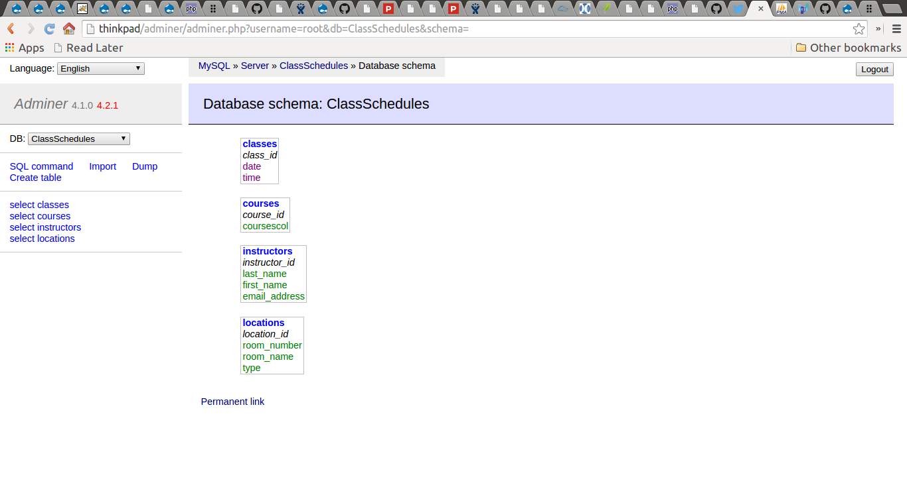

# Overview of the workshop

In this 4-hour workshop, participants will learn the basics of data modelling for relational databases, the relational database development process, and querying relational databases using SQL (Structured Query Language). The workshop will also present an overview of how relational databases are integrated into websites and other types of applications. The workshop will include a number of hands-on exercises and the chance to create, populate, and query a simple database.

# How relational databases work

## Tables, relationships, and IDs

Relational databases strucutre data in tables, and provide mechanisms for linking (relating) those tables together to so that the data can be queried and managed efficiently. For example, if we wanted to manage a list of books, we would create a table that contained some data about those books:


Each row in the table describes a single book, and the data is organized into columns, with each intersection of a row and a column containing a single piece of data. But if each intersection of a row and a column can contain only one piece of data, how do we handle data that can apply more than once to each book, such as its author? It's pretty common for a book to have more than one author.

Relational databases organize data into multiple tables, and link the tables together so that all the data about something (in our example, a single book) can be assembled from the relevant tables as needed. If we put data about authors in its own table, we can allow each book to have multiple authors. Because each book can have many authors, and each author can have written more than one book, we say that books and authors have a "many-to-many" relationship with each other. Relational databases accommodate this type of relationship by using a third table whose function is to relate the two things described in separate tables, as illustrated in this diagram:


This intermediate table (in this example, BookAuthors) is known as a "relation" or "join" table. For this method of breaking up data into multiple tables to work reliably, we need to ensure that each row in the books table and each row in the authors table can be referenced uniquely. To do this, we need to assign identifiers to each rown in the book and authors tables, and we use those identifiers to relate the two tables to each other in the third table. We will see some examples of these identifiers in the query examples below.

"One-to-many" relationships don't use a third table. This type of relationship links two tables, one containing the data that is on the "one" side of the relationship and the other that is on the "many" side. For example, each book can have many editions, but each edition applies to only a single book:


One-to-many relationships also require that rows in tables have unique IDs, but unlike in the join table used in many-to-many relationship, the table that contains the data describing the "many" side of the relationship has a column reserved for the ID of the "one" side of the relationship. 

The IDs used to uniquely identify the things described in tables are called "primary keys". If these IDs are used in other tables, they are called "foreign keys" in those tables. For example, the "book_id" column in the Books table is that table's primary key, but the "book_id" column in the Editions table is a foreign key.

Putting together all of our tables, we get a database structure that can be represented like this:


Books, Authors, and Editions all have a unique ID (book_id, author_id, and edition_id respectively) that is used as their primary key, and Editions contains the foreign key book_id that links it to the Books table in a one-to-many relationship. The relation table BooksAuthors only has two columns, book_id and author_id, which are both foreign keys.

Here are the tables, structured as illustrated above, with some data in them:

Books

```
+---------+------------------------------------------------------+---------------+
| book_id | title                                                | ISBN          |
+---------+------------------------------------------------------+---------------+
|       1 | Creating relational databases for fun and profit     | 7654321123456 |
|       2 | Relational databases for really, really smart people | 9876543212345 |
|       3 | My life with relational databases: a memoir          | 3212345678909 |
|       4 | Relational databases: an existential journey         | 8172635412345 |
+---------+------------------------------------------------------+---------------+
```

Authors
```
+-----------+---------------+------------+
| author_id | last_name     | first_name |
+-----------+---------------+------------+
|         1 | Lopez Baranda | Christina  |
|         2 | Jin-Soon      | Sin        |
|         3 | Jones         | Hannah     |
|         4 | Novak         | Stanislaw  |
|         5 | Turay         | Tandice    |
|         6 | Roy           | Shanta     |
|         7 | Berger        | Henry      |
|         8 | Khatami       | Paree      |
+-----------+---------------+------------+
```

BooksAuthors
```
+---------+-----------+
| book_id | author_id |
+---------+-----------+
|       3 |         6 |
|       2 |         4 |
|       2 |         5 |
|       1 |         1 |
|       1 |         3 |
|       1 |         5 |
|       4 |         8 |
+---------+-----------+
```

Editions
```
+------------+---------+---------------------+----------------+
| edition_id | book_id | date_of_publication | edition_number |
+------------+---------+---------------------+----------------+
|          1 |       3 |                2001 | 1              |
|          2 |       3 |                2003 | 2              |
|          3 |       4 |                2003 | 1              |
|          5 |       1 |                2000 | 1              |
|          6 |       3 |                2005 | 3              |
|          8 |       2 |                2012 | 1              |
|          9 |       3 |                2009 | 4              |
+------------+---------+---------------------+----------------+
```

## Querying tables using SQL

After we have populated the database with data (we'll explain how to do that later), we can query it using SQL (the Structured Query Language). For example, to view all information stored in the Authors table, sorted by last name, we use the following query:

```sql
SELECT * FROM Authors ORDER by last_name;
```

which produces the following:

```
+-----------+---------------+------------+
| author_id | last_name     | first_name |
+-----------+---------------+------------+
|         7 | Berger        | Henry      |
|         2 | Jin-Soon      | Sin        |
|         3 | Jones         | Hannah     |
|         8 | Khatami       | Paree      |
|         1 | Lopez Baranda | Christina  |
|         4 | Novak         | Stanislaw  |
|         6 | Roy           | Shanta     |
|         5 | Turay         | Tandice    |
+-----------+---------------+------------+
8 rows in set (0.01 sec)

```

Using uppercase for SQL commands is a convention only, it's not mandatory. Also, the output we're seeing here is specific to the MySQL command-line client, which we're not using in this workshop. How you query the databaase, and how the results output will look will depend on what tool is being used to manage the database.

This query asks for the first and last names of authors of the book with book_id 1:

```sql
SELECT DISTINCT first_name, last_name
FROM Authors, BooksAuthors, Books
WHERE BooksAuthors.author_id = Authors.author_id
AND BooksAuthors.book_id = 1;
```
The results are:

```
+------------+---------------+
| first_name | last_name     |
+------------+---------------+
| Hannah     | Jones         |
| Christina  | Lopez Baranda |
| Tandice    | Turay         |
+------------+---------------+
3 rows in set (0.01 sec)
```

This query is more complex than the first one, because it is asking for data from multiple tables. It relates the tables using the clause `WHERE BooksAuthors.author_id = Authors.author_id`, which in relational database jargon is called a "join" query (not to be confused with the join table used to store many-to-many relationships.)

To find the book IDs, titles, and ISBNs that have editions published after (that is, greater than) 2003, we would use this SQL query:

```sql
SELECT Books.book_id, title, ISBN, date_of_publication
FROM Books, Editions
WHERE Books.book_id = Editions.book_id
AND Editions.date_of_publication > '2003';
```

which returns the folowing results:

```
+---------+------------------------------------------------------+---------------+---------------------+
| book_id | title                                                | ISBN          | date_of_publication |
+---------+------------------------------------------------------+---------------+---------------------+
|       2 | Relational databases for really, really smart people | 9876543212345 |                2012 |
|       3 | My life with relational databases: a memoir          | 3212345678909 |                2005 |
|       3 | My life with relational databases: a memoir          | 3212345678909 |                2009 |
+---------+------------------------------------------------------+---------------+---------------------+
3 rows in set (0.00 sec)
```
You'll notice repetition in the book_id, title, and ISBN columns in the results. Those columns are the ones we're asking for in the query, so the response is correct, since we're also asking for the date of publication from the Editions table, which in our results contains the correct values.

## Relational database platforms

### Common RDBMS systems

There are many proprietary and open source relational database management systems (RDBMS). The most common include:

* [MySQL](https://www.mysql.com/)
* [PostgreSQL](http://www.postgresql.org/)
* [MariaDB](https://mariadb.org/)
* [SQLite](http://www.sqlite.org/)
* [Microsoft Access](https://products.office.com/en-us/access)
* [Filemaker](http://www.filemaker.com/products/overview.html)
* [Microsoft SQL Server](http://www.microsoft.com/en-ca/server-cloud/products/sql-server/)
* [Oracle](https://www.oracle.com/database/index.html)

While SQL is an [international standard](http://en.wikipedia.org/wiki/SQL#Standardization), and most of the systems listed above implment it thoroughly, every RDBMS has features or extensions to SQL that differentiate it from its competitors. Some, like Microsoft Access and Filemaker, include full graphical user interfaces to creating and querying databases. Others, like MySQL and PostgreSQL, include only a back-end server and command-line clients for querying and administration. It is common for third-party tools to be used to interact with these databases. Some of these tools are described in the next section.

### Tools for managing relational databases

Command line clients (e.g., mysql and psql), web-based management apps (e.g. web apps like [PHPMyAdmin](http://www.phpmyadmin.net/home_page/index.php) and [Adminer](http://www.adminer.org/), desktop management apps like [MySQL Workbench](https://www.mysql.com/products/workbench/)), custom applications.

The following is an "SQL file" (also known as a dump or script) produced by phpMyAdmin:

```sql
-- phpMyAdmin SQL Dump
-- version 4.0.10deb1
-- http://www.phpmyadmin.net
--
-- Host: localhost
-- Generation Time: Apr 16, 2015 at 07:16 AM
-- Server version: 5.5.41-0ubuntu0.14.04.1-log
-- PHP Version: 5.5.9-1ubuntu4.7

SET SQL_MODE = "NO_AUTO_VALUE_ON_ZERO";
SET time_zone = "+00:00";


/*!40101 SET @OLD_CHARACTER_SET_CLIENT=@@CHARACTER_SET_CLIENT */;
/*!40101 SET @OLD_CHARACTER_SET_RESULTS=@@CHARACTER_SET_RESULTS */;
/*!40101 SET @OLD_COLLATION_CONNECTION=@@COLLATION_CONNECTION */;
/*!40101 SET NAMES utf8 */;

--
-- Database: `ClassSchedules`
--

-- --------------------------------------------------------

--
-- Table structure for table `classes`
--

CREATE TABLE IF NOT EXISTS `classes` (
  `class_id` int(11) NOT NULL,
  `date` date DEFAULT NULL,
  `time` time DEFAULT NULL,
  PRIMARY KEY (`class_id`)
) ENGINE=InnoDB DEFAULT CHARSET=utf8 COLLATE=utf8_unicode_ci;

-- --------------------------------------------------------

--
-- Table structure for table `courses`
--

CREATE TABLE IF NOT EXISTS `courses` (
  `course_id` int(11) NOT NULL,
  `coursescol` varchar(20) COLLATE utf8_unicode_ci DEFAULT NULL,
  PRIMARY KEY (`course_id`)
) ENGINE=InnoDB DEFAULT CHARSET=utf8 COLLATE=utf8_unicode_ci;

-- --------------------------------------------------------

--
-- Table structure for table `instructors`
--

CREATE TABLE IF NOT EXISTS `instructors` (
  `instructor_id` int(11) NOT NULL,
  `last_name` varchar(100) COLLATE utf8_unicode_ci DEFAULT NULL COMMENT 'The instructor''s last name (or name conventionally used in alphabetical lists)\n',
  `first_name` varchar(100) COLLATE utf8_unicode_ci DEFAULT NULL,
  `email_address` varchar(100) COLLATE utf8_unicode_ci DEFAULT NULL,
  PRIMARY KEY (`instructor_id`)
) ENGINE=InnoDB DEFAULT CHARSET=utf8 COLLATE=utf8_unicode_ci;

-- --------------------------------------------------------

--
-- Table structure for table `locations`
--

CREATE TABLE IF NOT EXISTS `locations` (
  `location_id` int(11) NOT NULL,
  `room_number` varchar(45) COLLATE utf8_unicode_ci DEFAULT NULL,
  `room_name` varchar(100) COLLATE utf8_unicode_ci DEFAULT NULL,
  `type` varchar(45) COLLATE utf8_unicode_ci DEFAULT NULL,
  PRIMARY KEY (`location_id`)
) ENGINE=InnoDB DEFAULT CHARSET=utf8 COLLATE=utf8_unicode_ci;

/*!40101 SET CHARACTER_SET_CLIENT=@OLD_CHARACTER_SET_CLIENT */;
/*!40101 SET CHARACTER_SET_RESULTS=@OLD_CHARACTER_SET_RESULTS */;
/*!40101 SET COLLATION_CONNECTION=@OLD_COLLATION_CONNECTION */;
```

The following screenshots show the database in Adminer and in MySQL Workbench:


Adminer tables view


Adminer schema view


MySQL Workbench schema view


MySQL Workbench ER diagram view

# Data modeling for relational databases

* Entity-relationship modeling
* Normalization

## Relational database development process


Lists, then ER diagrams

## Entity-relationship modeling

List all entities (things) and their attributes

Class scheduling database, whose purpose is to aid in the scheduling of classes in a given semester.

* Classes
  * Date
  * Time
  * Course
  * Location
* Courses
  * Number
  * Title
  * Instructor
  * Department
  * Semester [Do we need semsester if we have dates?]
* Locations
  * Room number
  * Room name
  * Building
  * Type (classroom, seminar, amphitheatre, etc.)
  * Built-in projector [maybe split out into Room Details table?]
* Instructors
  * Last name
  * First name
  * Department [Do we need department here and in Courses?]
  * Email address

[@todo: Insert complete ER Diagram version of the above list, for MySQL Workbench at least and maybe Adminer too?]

## Normalization

## First Normal Form

Each column/row intersection can contain only one value. In our class locations database, courses.instructor can only have one instructor ID. 

## Second Normal Form

Applies to association tables with a composite key. All non-key columns must describe the entire composite key.

## Third Normal Form

Second Normal Form for non-association tables. Non non-key column must be dependent on another non-key column.

## Fourth and Fifth Normal Forms

Don't worry about these.

# Populating and querying relational databases

```sql
SELECT * FROM Authors ORDER by last_name;
```


Example of a user interface built using [Xataface](http://xataface.com/) for selecting values from linked tables. Image courtesy of John Dingle and Margaret Linley.

# Exercise: Using SQL

In this exercise, we will create a database that contains a single table describing shapes, populate the table with some data, and modify some of the data. Your instructor will provide the URL of the tool you will use, plus login credentials for the tool.

The ER diagram for the table (including the data types for each column) is:


* shape_id: This is the primary key for the table. It must be set to Auto Increment.
* name: The name of the shape, e.g., square, triangle, circle, etc.
* number_straight_sides: The number of straight sides the shape has. Make this field have a default value of 0 (zero).
* example_picture_url: To popluate this field, you will need to find a picture of the shape on the Web.
* real_world_example: Enter the name of an object that has this shape, e.g., for 'circle' you could use 'Frisbee'

## Creating a table

Won't be using SQL, we'll be using Adminer's web interface, but the SQL would be:

```sql
CREATE TABLE IF NOT EXISTS `shapes` (
  `shape_id` int(11) NOT NULL AUTO_INCREMENT,
  `name` text COLLATE utf8_unicode_ci NOT NULL,
  `number_straight_sides` int(11) NOT NULL DEFAULT '0',
  `example_picture_url` text COLLATE utf8_unicode_ci NOT NULL,
  `real_world_example` text COLLATE utf8_unicode_ci NOT NULL,
  PRIMARY KEY (`shape_id`)
) ENGINE=InnoDB DEFAULT CHARSET=utf8 COLLATE=utf8_unicode_ci AUTO_INCREMENT=1 ;
```

This is what you should see in Adminer:


## Inserting data

We'll use raw SQL to add (INSERT) a row into the table. Click on the "SQL command" link on the left-hand side of the Adminer interface and enter this:

```sql
INSERT INTO `shapes` (`name`, `number_straight_sides`, `example_picture_url`, `real_world_example`)
VALUES ('square', '4', 'http://www.mlahanas.de/Greeks/images/sq1.jpg', 'Window');
```

## Modifying data

```sql
UPDATE `shapes` SET
`real_world_example` = 'Plate'
WHERE `shape_id` = '1';
```

## Deleting data


## Selecting data

# Exercise: Selecting data from the Classes database

In this exercise, we will perform some SELECT queries on the Classes database we modelled earlier in the workshop. Your instructor will provide the URL of the tool you will use, plus login credentials for the tool.

1. Find all the..

2. Find all the 

# Integrating relational databases into applications

Examples: Wordpress database model (https://codex.wordpress.org/images/9/97/WP3.8-ERD.png); Firefox's history feature (https://developer.mozilla.org/en-US/docs/Mozilla/Tech/Places)

Database frameworks like [Symfony](http://symfony.com/) for PHP, [Django](https://www.djangoproject.com/) for Python, [Rails](http://rubyonrails.org/) for Ruby, [Play](https://www.playframework.com/) for Java. 

# Relational databases compared to other types of databases

NoSQL databases: Store non-tabular data. Examples include [CouchDB](http://couchdb.apache.org/), [MongoDB](https://www.mongodb.org/). Typical applications serve large-scale structured data or as complements to relational database applications. No standardized query language.

XML databases: Stores and queries XML documents, not tables. Typical application is for advanced queries against a set of XML documents using teh XPath or XQuery languages. Examples include [eXist](http://exist-db.org/), [BaseX](http://basex.org/).

Triplestores: Store statements comprised of subject, predicate, object as defined by RDF (Resource Description Framework). Typical application is in providing a search endpoint for Linked Data via the SPARQL query language. Examples include [Fuseki](http://jena.apache.org/documentation/fuseki2/index.html), [Virtuoso](http://virtuoso.openlinksw.com/).


# Exercise: Data modeling for relational databases

Sample topics:
* Database that tracks which articles cite which other articles
* Personal music, book (or other) collection
* Research project status reporter (for producing periodic updates)


# License

Except where noted, <a rel="license" href="http://creativecommons.org/licenses/by/4.0/"></a><br /><span xmlns:dct="http://purl.org/dc/terms/" href="http://purl.org/dc/dcmitype/Text" property="dct:title" rel="dct:type">Introduction to Relational Databases</span> by <span xmlns:cc="http://creativecommons.org/ns#" property="cc:attributionName">Mark Jordan</span> is licensed under a <a rel="license" href="http://creativecommons.org/licenses/by/4.0/">Creative Commons Attribution 4.0 International License</a>.